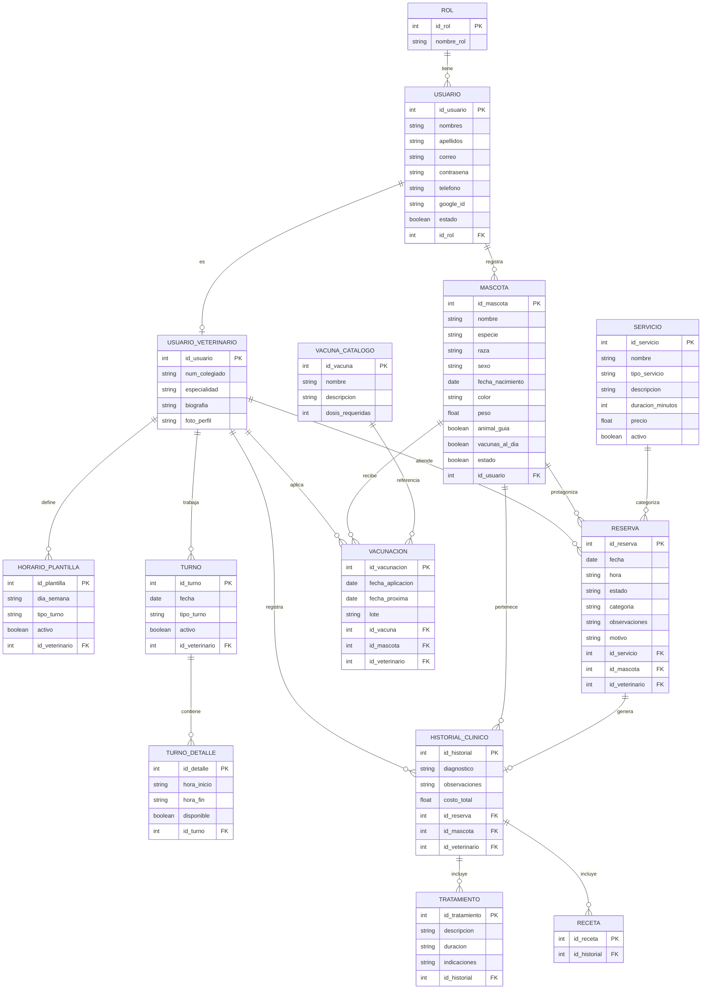

# 🐾 PetVission — Backend

API REST del sistema PetVission, desarrollada con Java 21 + Spring Boot.

---

## 👨‍💻 Equipo — Escuadrón Alpha Mango (ETM)

| Nombre | Rol | GitHub |
|---|---|---|
| Sabrina Jeria | Project Manager | [@sabrinaceciliajeria-cmyk](https://github.com/sabrinaceciliajeria-cmyk) |
| Diego Peña | Líder técnico | [@DiegoPenaG](https://github.com/DiegoPenaG) |
| Manuel Labrador | QA / Tester | [@MannuDLab](https://github.com/MannuDLab) |
| Arantxa Fischer | Frontend | [@a-scarfisch](https://github.com/a-scarfisch) |
| Cristian Diaz | Backend | [@Cristian-DH](https://github.com/Cristian-DH) |
| Cristopher Contreras | Backend | [@cristophercontrerasinformatica-dev](https://github.com/cristophercontrerasinformatica-dev) |
| Natalia Medel | Backend | [@NataliaMedelM](https://github.com/NataliaMedelM) |

---

## ⚙️ Requisitos previos

- Java 21 LTS
- Maven 3.9.9 (incluido vía Maven Wrapper)
- PostgreSQL 17
- Variables de entorno configuradas

---

## 🚀 Cómo correr el proyecto

1. Clonar el repositorio
```bash
git clone https://github.com/DiegoPenaG/Proyecto-Integrador-Pet-vission-BackEnd
```

2. Copiar el archivo de variables de entorno
```bash
cp .env.example .env
```

3. Completar los valores en `.env`
```env
DB_URL=jdbc:postgresql://localhost:5432/petvission_db
DB_USERNAME=tu_usuario
DB_PASSWORD=tu_password
JWT_SECRET=tu_clave_secreta
```

4. Ejecutar
```bash
./mvnw spring-boot:run
```

La API estará disponible en: `http://localhost:8080`

> El proyecto incluye `Dockerfile` para build multi-stage y está desplegado en Render.

---

## 🗺️ Modelo Entidad-Relación

> Diagrama del modelo de dominio actual (Fase 2). Nota: `docs/entidad.md` corresponde a la Fase 1 (solo Usuario/Mascota/Cita) y está desactualizado respecto a este modelo.



---

## 📁 Estructura del proyecto

Organización por feature (un paquete por dominio: `controller / dto / mapper / model / repository / service`).

```
src/main/java/com/petvission/
│
├── PetVissionApplication.java
│
├── admin/
│   └── controller/
│       └── AdminController.java
│
├── auth/
│   ├── controller/
│   │   └── AuthController.java
│   ├── dto/
│   │   ├── AuthRequestDto.java
│   │   ├── AuthResponseDto.java
│   │   ├── GoogleAuthRequestDto.java
│   │   └── RegisterRequestDto.java
│   └── service/
│       └── AuthService.java
│
├── usuario/
│   ├── controller/
│   │   └── UsuarioController.java
│   ├── dto/
│   │   ├── CreateVeterinarioDto.java
│   │   ├── UsuarioRequestDto.java
│   │   └── UsuarioResponseDto.java
│   ├── mapper/
│   │   └── UsuarioMapper.java
│   ├── model/
│   │   ├── Rol.java
│   │   ├── Usuario.java
│   │   └── UsuarioVeterinario.java
│   ├── repository/
│   │   ├── RolRepository.java
│   │   ├── UsuarioRepository.java
│   │   └── UsuarioVeterinarioRepository.java
│   └── service/
│       └── UsuarioService.java
│
├── mascota/
│   ├── controller/
│   │   └── MascotaController.java
│   ├── dto/
│   │   ├── MascotaRequestDto.java
│   │   ├── MascotaResponseDto.java
│   │   └── ReasignarMascotaDto.java
│   ├── mapper/
│   │   └── MascotaMapper.java
│   ├── model/
│   │   └── Mascota.java
│   ├── repository/
│   │   └── MascotaRepository.java
│   └── service/
│       └── MascotaService.java
│
├── reserva/                          ← antes "cita"
│   ├── controller/
│   │   └── ReservaController.java
│   ├── dto/
│   │   ├── AgendaVeterinarioDto.java
│   │   ├── PacienteVetDto.java
│   │   ├── ReprogramarReservaDto.java
│   │   ├── ReservaRequestDto.java
│   │   ├── ReservaResponseDto.java
│   │   └── ReservaUsuarioDto.java
│   ├── mapper/
│   │   └── ReservaMapper.java
│   ├── model/
│   │   ├── CategoriaReserva.java     ← enum
│   │   ├── EstadoReserva.java        ← enum: PENDIENTE, CONFIRMADA, CANCELADA, COMPLETADA
│   │   └── Reserva.java
│   ├── repository/
│   │   └── ReservaRepository.java
│   └── service/
│       └── ReservaService.java
│
├── servicio/                         ← módulo nuevo (Fase 2)
│   ├── ServicioDataInitializer.java
│   ├── controller/
│   │   └── ServicioController.java
│   ├── dto/
│   │   ├── ServicioRequestDto.java
│   │   └── ServicioResponseDto.java
│   ├── mapper/
│   │   └── ServicioMapper.java
│   ├── model/
│   │   ├── Servicio.java
│   │   └── TipoServicio.java         ← enum
│   ├── repository/
│   │   └── ServicioRepository.java
│   └── service/
│       └── ServicioService.java
│
├── historialClinico/                 ← antes "atencion"
│   ├── controller/
│   │   └── HistorialClinicoController.java
│   ├── dto/
│   │   ├── HistorialClinicoRequestDto.java
│   │   ├── HistorialClinicoResponseDto.java
│   │   ├── NuevaConsultaRequestDto.java
│   │   ├── TratamientoResponseDto.java
│   │   └── VacunaEnHistorialDto.java
│   ├── mapper/
│   │   └── HistorialClinicoMapper.java
│   ├── model/
│   │   ├── HistorialClinico.java
│   │   ├── Receta.java
│   │   └── Tratamiento.java
│   ├── repository/
│   │   ├── HistorialClinicoRepository.java
│   │   ├── RecetaRepository.java
│   │   └── TratamientoRepository.java
│   └── service/
│       └── HistorialClinicoService.java
│
├── vacunacion/                       ← módulo nuevo (Fase 2)
│   ├── controller/
│   │   └── VacunacionController.java
│   ├── dto/
│   │   ├── VacunacionRequestDto.java
│   │   └── VacunacionResponseDto.java
│   ├── mapper/
│   │   └── VacunacionMapper.java
│   ├── model/
│   │   ├── VacunaCatalogo.java
│   │   └── Vacunacion.java
│   ├── repository/
│   │   ├── VacunaCatalogoRepository.java
│   │   └── VacunacionRepository.java
│   └── service/
│       └── VacunacionService.java
│
├── turno/                            ← turnos, slots y plantillas
│   ├── PlantillaDataInitializer.java
│   ├── controller/
│   │   └── TurnoController.java
│   ├── dto/
│   │   ├── ActualizarDisponibilidadDto.java
│   │   ├── GeneracionResponseDto.java
│   │   ├── HorarioPlantillaResponseDto.java
│   │   ├── TurnoDetalleRequestDto.java
│   │   ├── TurnoDetalleResponseDto.java
│   │   ├── TurnoRequestDto.java
│   │   └── TurnoResponseDto.java
│   ├── mapper/
│   │   └── TurnoMapper.java
│   ├── model/
│   │   ├── DiaSemana.java            ← enum
│   │   ├── HorarioPlantilla.java
│   │   ├── TipoTurno.java            ← enum
│   │   ├── Turno.java
│   │   └── TurnoDetalle.java
│   ├── repository/
│   │   ├── HorarioPlantillaRepository.java
│   │   ├── TurnoDetalleRepository.java
│   │   └── TurnoRepository.java
│   └── service/
│       └── TurnoService.java
│
└── shared/
    ├── exception/
    │   ├── GlobalExceptionHandler.java
    │   ├── ResourceNotFoundException.java
    │   └── UnauthorizedException.java
    ├── health/
    │   └── HealthController.java
    └── response/
        └── ApiResponse.java

src/main/resources/application.yaml
src/test/java/com/petvission/PetVissionApplicationTests.java
```

---

## 📡 Endpoints

Todas las respuestas se devuelven envueltas en `ApiResponse<T>` → `{ success, message, data }`.

### Auth — `/api/auth` (Público)
| Método | Ruta | Descripción |
|---|---|---|
| POST | `/api/auth/register` | Registro de usuario |
| POST | `/api/auth/login` | Inicio de sesión |
| POST | `/api/auth/google` | Login con Google OAuth |

### Servicios — `/api/servicios`
| Método | Ruta | Descripción |
|---|---|---|
| GET | `/api/servicios` | Listar todos los servicios |
| GET | `/api/servicios/activos` | Listar servicios activos |
| GET | `/api/servicios/{id}` | Detalle de un servicio |
| POST | `/api/servicios` | Crear servicio |
| PUT | `/api/servicios/{id}` | Actualizar servicio |
| PATCH | `/api/servicios/{id}/desactivar` | Desactivar servicio |

### Reservas — `/api/reservas` (Requiere JWT)
| Método | Ruta | Descripción |
|---|---|---|
| GET | `/api/reservas` | Todas las reservas (ADMIN) |
| POST | `/api/reservas` | Agendar reserva |
| GET | `/api/reservas/agenda` | Agenda general |
| GET | `/api/reservas/agenda/veterinario/{idVeterinario}` | Agenda mensual del veterinario |
| GET | `/api/reservas/disponibilidad` | Disponibilidad básica |
| GET | `/api/reservas/usuario/{idUsuario}` | Reservas de un cliente |
| GET | `/api/reservas/veterinario/{idVeterinario}` | Reservas de un veterinario |
| GET | `/api/reservas/veterinario/{idVeterinario}/hoy` | Reservas de hoy del veterinario |
| GET | `/api/reservas/veterinario/{idVeterinario}/pacientes` | Pacientes del veterinario |
| GET | `/api/reservas/fecha` | Reservas por fecha |
| PATCH | `/api/reservas/{id}/confirmar` | Confirmar reserva |
| PATCH | `/api/reservas/{id}/completar` | Completar reserva |
| PATCH | `/api/reservas/{id}/cancelar` | Cancelar reserva |
| PATCH | `/api/reservas/{id}/reprogramar` | Reprogramar reserva |

### Turnos — `/api/turnos` (Requiere JWT)
| Método | Ruta | Descripción |
|---|---|---|
| GET | `/api/turnos` | Listar turnos |
| POST | `/api/turnos` | Crear turno |
| POST | `/api/turnos/generar` | Generar turnos desde plantilla |
| GET | `/api/turnos/veterinario/{idVeterinario}` | Turnos de un veterinario |
| GET | `/api/turnos/veterinario/{idVeterinario}/disponibilidad` | Disponibilidad del veterinario |
| GET | `/api/turnos/{id}/detalles/disponibles` | Slots disponibles de un turno |
| PATCH | `/api/turnos/{id}/activar` | Activar turno |
| PATCH | `/api/turnos/{id}/desactivar` | Desactivar turno |
| PUT | `/api/turnos/{id}/disponibilidad` | Actualizar disponibilidad de un slot |
| GET | `/api/turnos/horario-plantilla/todas` | Listar plantillas de horario |
| GET | `/api/turnos/horario-plantilla/veterinario/{idVeterinario}` | Plantillas del veterinario |
| PATCH | `/api/turnos/horario-plantilla/{id}/activar` | Activar plantilla |
| PATCH | `/api/turnos/horario-plantilla/{id}/desactivar` | Desactivar plantilla |

### Historial Clínico — `/api/historial` (Requiere JWT)
| Método | Ruta | Descripción |
|---|---|---|
| GET | `/api/historial/mascota/{idMascota}` | Historial clínico de una mascota |
| POST | `/api/historial` | Crear registro de historial |
| POST | `/api/historial/mascota/{idMascota}` | Nueva consulta para una mascota |
| PATCH | `/api/historial/{idHistorial}/diagnostico` | Registrar diagnóstico |
| PATCH | `/api/historial/{idHistorial}/tratamiento` | Registrar tratamiento |

### Vacunación — `/api/vacunacion` (Requiere JWT)
| Método | Ruta | Descripción |
|---|---|---|
| POST | `/api/vacunacion` | Registrar vacuna aplicada |
| GET | `/api/vacunacion/catalogo` | Catálogo de vacunas disponibles |

### Usuarios — `/api/usuarios` (Requiere JWT)
| Método | Ruta | Descripción |
|---|---|---|
| GET | `/api/usuarios` | Listar usuarios (ADMIN) |
| GET | `/api/usuarios/{id}` | Detalle de un usuario |
| GET | `/api/usuarios/veterinarios` | Listar veterinarios |
| GET | `/api/usuarios/clientes` | Listar clientes |
| PUT | `/api/usuarios/{id}` | Actualizar usuario |
| DELETE | `/api/usuarios/{id}` | Eliminar usuario |

### Mascotas — `/api/mascotas` (Requiere JWT)
| Método | Ruta | Descripción |
|---|---|---|
| GET | `/api/mascotas/todas` | Todas las mascotas (ADMIN) |
| GET | `/api/mascotas/{id}` | Detalle de una mascota |
| GET | `/api/mascotas/usuario/{idUsuario}` | Mascotas de un usuario |
| POST | `/api/mascotas/usuario/{idUsuario}` | Crear mascota para un usuario |
| PUT | `/api/mascotas/{id}` | Actualizar mascota |
| DELETE | `/api/mascotas/{id}` | Eliminar (soft delete) mascota |
| PATCH | `/api/mascotas/{id}/reasignar` | Reasignar dueño de una mascota |

### Administración — `/api/admin` (Requiere JWT · ADMINISTRADOR)
| Método | Ruta | Descripción |
|---|---|---|
| POST | `/api/admin/veterinarios` | Crear veterinario |

### Sistema — `/api/health`
| Método | Ruta | Descripción |
|---|---|---|
| GET | `/api/health` | Estado del servidor y BD |

---

## 🔄 Cambios Fase 2 respecto a Fase 1

| Fase 1 | Fase 2 | Tipo de cambio |
|---|---|---|
| `org.example.petvission` | `com.petvission` | Migración de paquete base |
| Módulo `cita` (`Cita`) | Módulo `reserva` (`Reserva`) | Renombrado + refactor |
| `EstadoCita` | `EstadoReserva` (+ `CategoriaReserva`) | Enums nuevos |
| Módulo `atencion` | Módulo `historialClinico` (`HistorialClinico`, `Receta`, `Tratamiento`) | Renombrado + ampliado |
| `/api/citas` | `/api/reservas` | Endpoint actualizado |
| Sin módulo `servicio` | `servicio` con seed de servicios y `TipoServicio` | Módulo nuevo |
| Sin módulo `vacunacion` | `vacunacion` + `vacuna_catalogo` | Módulo nuevo |
| Sin módulo `admin` | `admin` (panel administrador) | Módulo nuevo |
| `turno` básico | `turno` con `TurnoDetalle`, `HorarioPlantilla` y generador (incl. turno nocturno) | Ampliado |
| Sin OAuth | Login con Google (`googleId` en `Usuario`) | Funcionalidad nueva |
| Respuestas mixtas | Todo envuelto en `ApiResponse<T>` | Estandarización |
| Mascota hard delete | Soft delete + `animalGuia` + filtro de activas | Mejora |

---

## 🛠️ Stack

| Tecnología | Versión |
|---|---|
| Java | 21 LTS |
| Spring Boot | Última estable |
| Spring Security | Incluida |
| Spring Data JPA | Incluida |
| PostgreSQL | 17 |
| Maven | 3.9.9 (wrapper) |
| JWT | io.jsonwebtoken |
| Lombok | Última estable |
| Deploy | Render (Docker) |

---

## 🔗 Repositorios

- Frontend: [petvission-front](https://github.com/DiegoPenaG/petvission-front)
- Backend: [Proyecto-Integrador-Pet-vission-BackEnd](https://github.com/DiegoPenaG/Proyecto-Integrador-Pet-vission-BackEnd)
```